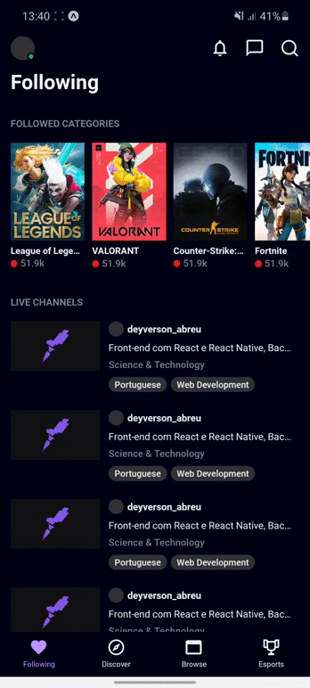

## :rocket: Technologies

This project was built using the following technologies:

- [React Native](https://facebook.github.io/react-native/)
- [Typescript](https://www.typescriptlang.org/)
- [Expo](https://expo.io/)

## 💻 Project

Project built for the purpose of improving mobile interfaces development.

## 🔖 How to run

#### Cloning the project
```sh
git clone https://github.com/Deyverson73/ui-clone-twitch.git
cd happy
npm install
```
#### Starting
```sh
cd ui-clone-twitch
yarn
expo start
```

---

By Deyverson Abreu 